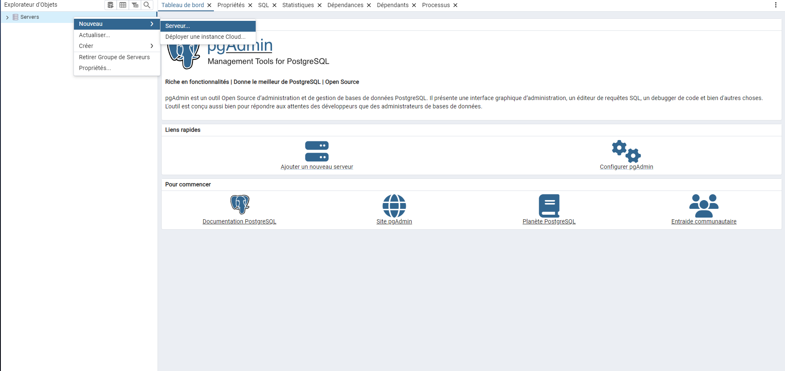
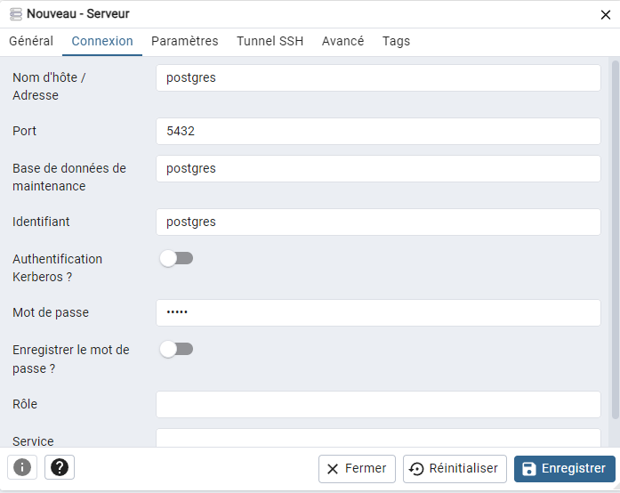
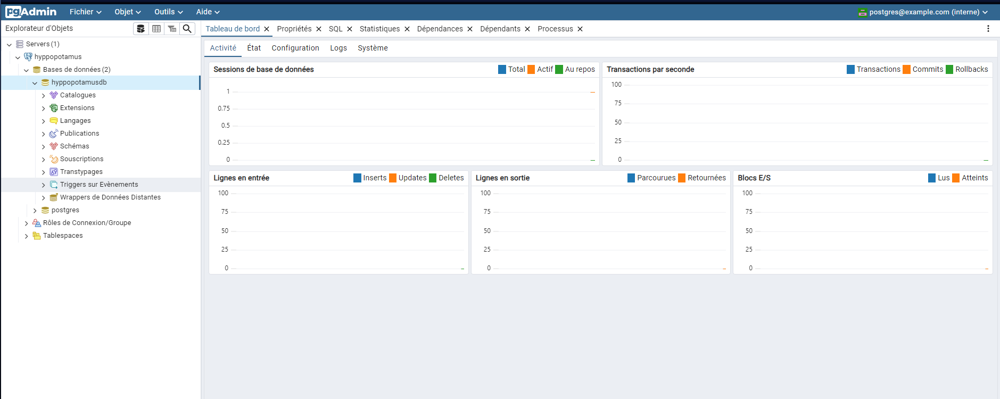

# Hackaton

## Getting started

### Docker

#### Environnement de travail

1. Récupérer le code:

Ouvrir un terminal et lancer une des deux requêtes:
si vous avez une cléh SSH:
ssh

    ```sh
    git clone git@github.com:Eric-Philippe/Hackaton_Hippo.git
    ```

sinon:
https
`sh
    git clone https://github.com/Eric-Philippe/Hackaton_Hippo.git
    `

Installer docker → https://docs.docker.com/get-docker/ 2. Démarrer l'application docker compose

variables d'environnement à mettre dans le fichier .env à la racine du projet si il n'y est pas déja:

```
→Postgres:
PG_USER='postgres'
PG_PASS='admin'
PG_HOST='postgres'
PG_DB='hyppopotamusdb'
PG_PORT=5432
PG_ADMIN_PORT=5050
PGADMIN_DEFAULT_EMAIL='postgres@example.com'
PGADMIN_DEFAULT_PASSWORD='admin'

→ Api:
EMAIL_FROM='hyppopotamus.com'
EMAIL_USER='user'
EMAIL_PASS='password'
API_PORT=8001
API_ADDRESS='localhost'
JWT_SECRET='secret'
JWT_EXPIRES_IN='1d'
BYPASS_AUTH=true

→Front:
FRONT_PORT='80'
```

3. Lancer l'application

```sh
docker-compose up -d --build
```

#### PG admin

#### Se connecter:

→ Lorsque les containers Docker sont démmarés, PG admin est accessible sur l'adresse du serveur au port 5050 (ou un autre port défini dans le .env):

> Par exemple localhost:5050

→ Une fois sur PGAdmin se connecter avec les identifiants définis dans le .env
Mail: postgres@example.com
mot de passe admin

#### Acceder à la BDD après la première connection

clic droit sur serveur→nouveau→server

Mettre le nom de votre choix:

aller sur la section Connexion et entrer les informations définies dans le .env:

(Le mot bde passe est celui de pg_pass)

Vous avez désormais accès à la BDD

Votre configuration sera enregistrée dans le volume Docker ainsi vous pourrais la retrouver a chaque connection.

### Local

L'API et le Frontend peuvent être lancé en local.

> Un serveur de base de données Postgres doit être lancé en local pour que l'API fonctionne également.

En allant dans les dossiers respectifs, vous pouvez lancer les commandes suivantes:

```sh
$ cd frontend/

$ npm install

$ ng serve
```

```sh
$ cd api_hyppo/

$ npm install

$ npm run dev
```
